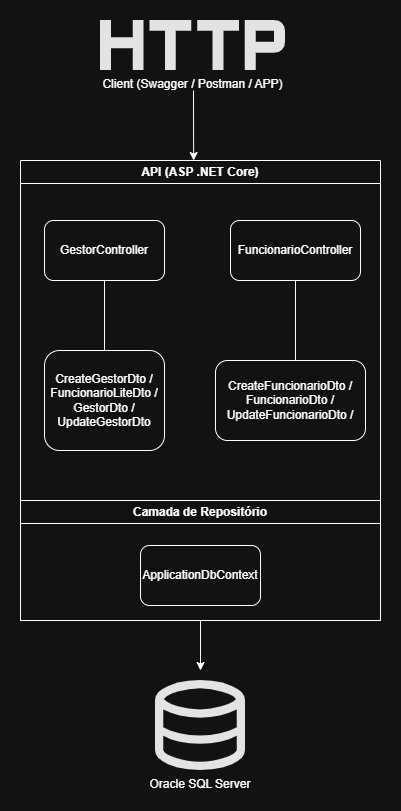

# 🌐 GLOBAL SOLUTIONS 2025 (GS) – FutureWork API

## 📖 Descrição do Projeto
O futuro do trabalho já começou. Avanços tecnológicos, como **robótica**, **automação** e **Internet das Coisas**, estão transformando profissões, criando novas oportunidades e desafios inéditos.  
Este projeto faz parte da proposta interdisciplinar **Global Solutions** e está alinhado à ideia central desenvolvida pelo grupo: **como a tecnologia pode otimizar processos e melhorar a gestão de equipes no cenário corporativo do futuro**.

Nosso sistema é uma **API RESTful** desenvolvida em **C# (.NET 8)** com **Entity Framework Core** e **Oracle Database**, permitindo o gerenciamento de **Gestores** e **Funcionários** com operações CRUD, garantindo escalabilidade e integração com sistemas modernos.


---

## 🎥 Link para o vídeo de demonstração
👉 [**Assista à demonstração no YouTube**](https://www.youtube.com/seu-link-aqui)

---

## 🔗 Endpoints Principais
### **Gestores**
- `GET /api/v1/gestor` → Lista todos os gestores.
- `GET /api/v1/gestor/{id}` → Busca gestor por ID.
- `POST /api/v1/gestor` → Cria um novo gestor.
- `PUT /api/v1/gestor/{id}` → Atualiza dados do gestor.
- `DELETE /api/v1/gestor/{id}` → Remove gestor.

### **Funcionários**
- `GET /api/v1/funcionarios` → Lista todos os funcionários.
- `GET /api/v1/funcionarios/{id}` → Busca funcionário por ID.
- `POST /api/v1/funcionarios` → Cria um novo funcionário.
- `PUT /api/v1/funcionarios/{id}` → Atualiza dados do funcionário.
- `DELETE /api/v1/funcionarios/{id}` → Remove funcionário.

---

## 🧾 Exemplos de JSON
### **POST Gestor**
```json
{
  "nome": "Carlos Silva",
  "email": "carlos.silva@empresa.com",
  "matricula": "GEST123"
}
```

### **POST Funcionário**
```json
{
  "nome": "João Pereira",
  "email": "joao.pereira@empresa.com",
  "matricula": "FUNC001",
  "gestorId": 1
}
```

---

## 🛠️ Tecnologias Utilizadas
- **C# (.NET 8)** – API REST
- **Entity Framework Core** – ORM
- **Oracle Database** – Persistência
- **Swagger** – Documentação e testes
- **DTOs + LINQ** – Projeção e prevenção de ciclos
- **Arquitetura em camadas** – Controller → Service → Data → Database

---

## 🗂️ Diagrama de Arquitetura


---

## ✅ Como Executar
1. Clone o repositório:
   ```bash
   git clone https://github.com/seu-repo.git
   ```
2. Configure a **connection string** no `appsettings.json`:
   ```json
   {
     "ConnectionStrings": {
       "Default": "User Id=SEU_USUARIO;Password=SUA_SENHA;Data Source=oracle.fiap.com.br:1521/ORCL;"
     }
   }
   ```
3. Instale as dependências:
   ```bash
   dotnet restore
   ```
4. Execute as migrations:
   ```bash
   dotnet ef database update
   ```
5. Inicie a API:
   ```bash
   dotnet run
   ```

## 👥 Membros do Grupo

| Nome                                | RM       |
|-------------------------------------|----------|
| ⚡ João Pedro Borsato Cruz           | RM550294 |
| 💫 Maria Fernanda Vieira de Camargo | RM97956  |
| 🚀 Pedro Lucas de Andrade Nunes     | RM550366 |